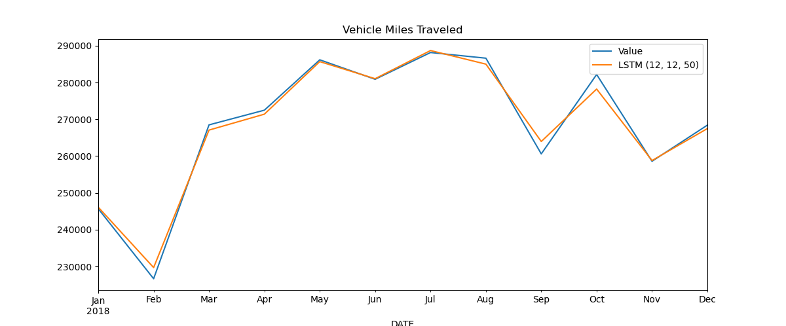

# Miles Traveled

## Description
Small project which uses different models to fit the data of [Vehicle Miles Traveled (TRFVOLUSM227NFWA)](https://fred.stlouisfed.org/series/TRFVOLUSM227NFWA) using the monthly data from 1970 to 2018.
Current models implemented:
- LSTM
- SARIMA

## Output
This will output the RMSE errors for the different models we decide to run with a graph for visualization.

## Tunable parameters
We can choose to run multiple combinations by modifying these variables at the end of the script:
- n_input: number of timestamps used for predictions)
- n_preds: number of predictions (size of the test set)
- epochs: number of training epochs (for the LSTM model)

## Remarks
### LSTM
The LSTM model seems to be working very well for predicting a full year with 37 years of historical data. It obtains an RMSE error of under 2000 with values in the range of 220000 to 290000.

### SARIMA
The SARIMA model does a bit worse than the LSTM, but takes less time to train. It obtains an RMSE error of under 3100.
